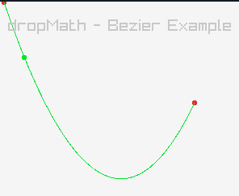

# dropMath

| dropMath is a simple single header math library intended to be used in games. |
|-------------------------------------------------------------------------------|

> :star: We are looking for more developers. Feel free to contribute!


[](https://circleci.com/gh/DropSoftCommunity/dropMath/tree/main)
[](https://www.gnu.org/licenses/gpl-3.0)


---

### Table of Contents
- [Description](#about)
- [Installation](#installation)
- [Usage Examples](#examples)
- [Documentation](#documentation)
- [Contact](#contact)


---

## About

dropMath is a single header C++ math library with a primary focus on
ease of use.

The main target audience for this library are game developers who want
to have a modern C++ interface for the math library they are using.

## Installation

To install and use dropMath you only need to include the header (header/dropMath)
in this repository.

[](https://youtu.be/SEkMLR5pExY)

### Download the header

In your project directory run:
```sh
wget https://raw.githubusercontent.com/DropSoftCommunity/dropMath/main/header/dropMath.hpp
```
You should now have the header file `dropMath.hpp` in your project directory.

### Use the dropMath header

You should now be able to include the header from the same directory in your
source files like this:
```C++
#include "dropMath.cpp" //include dropMath

int main(){
	/*Drop Math can now be used.
	  As an example I just created a Vector3 here
	*/
	drop::math::Vector3 vec{ 1.f, 2.f, 3.f };

	//...
	return 0;
}
```

## Examples



You can find some example usage of the library in the [examples](./examples/) directory
of this repository.

We do also have a YouTube Playlist with usage examples:
[](https://youtube.com/playlist?list=PLTjUlazALHSAA-VpiKxJCDdx2MRvEnBw1)


## Documentation
This still needs to be done...

### Contact

